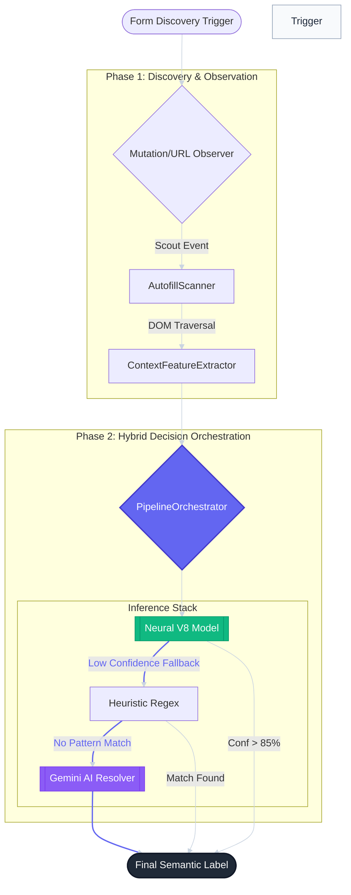
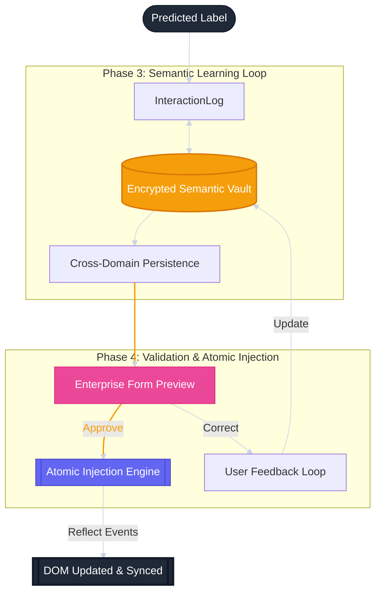
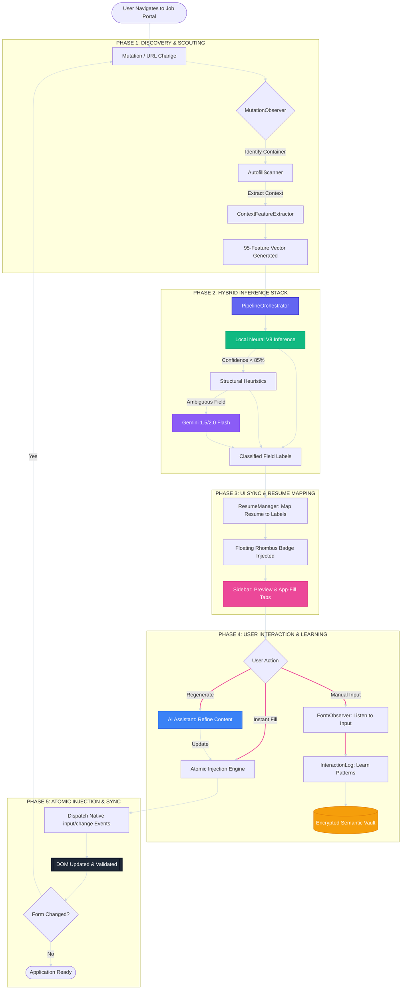

# Nova Apply - System Architecture 🏢

This document provides a high-fidelity technical overview of how Nova Apply orchestrates form analysis and intelligent autofilling.

---

## 1. The Inference Pipeline: Intelligence at the Edge 🧠

This diagram illustrates the real-time detection and classification lifecycle — moving from raw DOM mutations to a high-confidence semantic label.

---

## 2. The Execution Loop: Memory & Persistence 💾

This diagram shows how Nova Apply bridges the gap between a predicted label and a physically filled form, while building a long-term "Smart Knowledge Base."

---

## 3. User Journey: End-to-End Form Flow 🚀

This is the comprehensive flow of how a user interacts with Nova Apply on a job portal (Workday, Greenhouse, etc.), detailing the interaction between the Extension UI, the Page DOM, and our Local Intelligence.

## Key Components

### 1. Hybrid Classifier
The brain of the system. Instead of relying on a single source of truth, Nova Apply uses an ensemble approach:
*   **Neural V8**: A local classifier running a 3-layer Dense network for sub-10ms inference.
*   **Heuristic Regex**: A lightning-fast fallback for standard fields using industry-standard patterns.
*   **Gemini AI**: A powerful large language model for synthesizing complex answers from resume context.

### 2. Pipeline Orchestrator
The "Conductor" that manages state transitions. It ensures that data is only injected once it has passed through validation and structural mapping phases.

### 3. Semantic Memory (InteractionLog)
Moves beyond simple field-name caching. By indexing choices against **semantic meaning**, Nova learns that "What is your gender?" and "Sex" require the same answer across different platforms.

### 4. Atomic Injection
Ensures compatibility with modern frameworks (React, Vue, Angular) by dispatching native `input` and `change` events instead of just setting property values.
