# 🏛️ Smart HireX Architecture & Execution Flow

## 🌟 Philosophy: The "FANG-Level" Standard
This project is not just a script; it is an **Enterprise-Grade State Engine** designed to rival the sophistication of Google Autofill and Apple's On-Device Intelligence.

We adhere to three core principles:
1.  **Zero Bloat**: No heavy dependencies. We implement our own Math Kernels (TinyML) and use native browser APIs (CompressionStream).
2.  **Privacy First**: Data is Encrypted (Base64+Salt), Local-Only (No Cloud Sync), and Differential (Anonymous Reporting).
3.  **Self-Healing**: The system learns from its mistakes via "Shadow Validation" (Reinforcement Learning).

---

## 📊 System Architecture Diagram

```mermaid
graph TD
    User((User)) -->|Click Auto-Fill| Sidebar[Sidebar UI]
    Sidebar -->|Msg: FILL_PAGE| Orch[Orchestrator]
    
    subgraph Scanning ["🔵 Scanning & Vision"]
        Orch --> Scanner[FormScanner]
        Orch --> Sections[SectionDetector]
        Scanner -->|Fields| Feat[FeatureExtractor]
        Sections -->|Context| Feat
        Feat -->|Vectors| Neural[NeuralClassifier]
        Neural -->|Classified Fields| Router[FieldRouter]
    end

    subgraph Decision ["🟣 Decision Engine"]
        Router -->|Check key| Cache[UnifiedCache]
        Cache -->|Hit| Queue[ActionQueue]
        Cache -->|Miss| Batch[BatchProcessor]
    end

    subgraph Execution ["🔴 Execution & Learning"]
        Batch -->|LLM Request| Gemini[Gemini 1.5 Flash]
        Gemini -->|Response| Save[Write-Through Save]
        Save -->|Update| Cache
        Save -->|Fill| Queue
        Queue -->|Type| DOM[Web Page]
        
        DOM -.->|User Correction| Shadow[ShadowValidator]
        Shadow -->|Reinforcement| Cache
    end
```

---

## 🟢 1. Initialization Phase (`Load`)
**Goal**: Prepare the environment when the user visits a job page.

1.  **Injection**: Chrome reads `manifest.json`.
    *   **File**: `manifest.json`
    *   **Action**: Injects `content/content.js` and all service scripts into the page.
2.  **Boot**: The `StateManager` wakes up.
    *   **File**: `content/core/state-manager.js`
    *   **Action**: Checks if the sidebar should be open. Restores previous session state.
3.  **Cache Hydration**: The `UnifiedCacheManager` loads data from disk.
    *   **File**: `content/services/cache/cache-manager.js`
    *   **Action**: Reads `chrome.storage.local`, decrypts Base64 data, decompresses (Gzip), and warms up the in-memory cache.

---

## 🟡 2. Trigger Phase (`User Action`)
**Goal**: Start the filling process.

1.  **Event**: User clicks "Auto-Fill" on the Sidebar.
2.  **Command**: The UI sends a message to the Orchestrator.
    *   **File**: `content/core/orchestrator.js`
    *   **Action**: `handleFillRequest()` is called. It acts as the "General," coordinating all other services.

---

## 🔵 3. Scanning & Analysis Phase (`The "Eyes"`)
**Goal**: Understand what is on the screen.

1.  **Form Detection**: Find input fields.
    *   **File**: `content/services/extraction/form-detection.js`
    *   **Action**: Scans the DOM for `<input>`, `<select>`, `<textarea>`. Ignores hidden/irrelevant fields.
2.  **Section Detection**: Understand context.
    *   **File**: `content/services/extraction/section-detector.js`
    *   **Action**: Looks for headers like "Education", "Experience". Uses heuristics (font size, keywords) to group fields into sections.
3.  **Feature Extraction**: Vectorize fields for AI.
    *   **File**: `content/services/ai/feature-extractor.js`
    *   **Action**: Converts a field like `<input id="fname">` into a mathematical vector `[0.1, 0.5, ...]`.
4.  **Classification**: Identify field types.
    *   **File**: `content/services/ai/neural-classifier.js`
    *   **Action**: The TinyML engine runs inference. Logic: *"This field is next to 'Last Name', effectively labeled 'First Name'. I predict it is `first_name` with 99% confidence."*

---

## 🟣 4. Decision Phase (`The "Brain"`)
**Goal**: Decide *where* to get the data from.

1.  **Routing**: The `FieldRouter` takes the classified field and asks: "Who handles this?"
    *   **File**: `content/field-router.js`
    *   **Action**:
        *   If it's a simple text field (Name, Email) -> **Cache**.
        *   If it's complex (Bio, "Why do you fit?") -> **AI Generation**.
        *   If it's structured (Job History) -> **History Manager**.
2.  **Cache Lookup**: Check memory first.
    *   **File**: `content/services/cache/cache-manager.js`
    *   **Action**: `get(field)`. Checks Semantic Signature `sig_v1|context|label`.
        *   **Hit**: Returns decrypted value immediately.
        *   **Miss**: Marks field for AI generation.

---

## 🔴 5. Execution Phase (`The "Hands"`)
**Goal**: Fill the fields and handle complex logic.

1.  **Batch Processing**: Bundle AI requests.
    *   **File**: `content/services/ai/batch-processor.js`
    *   **Action**: Instead of 10 API calls, it groups 10 missing fields into ONE request to the LLM (Gemini/GPT). "Generate answers for [Bio, Cover Letter, Skills]".
2.  **History Matching**: Fill repetitive data.
    *   **File**: `content/services/cache/history-manager.js`
    *   **Action**: Maps "Job 1" on Resume to "Employment History Block 1" on the form.
3.  **Physical Filling**: Type into the page.
    *   **File**: `content/core/action-queue.js`
    *   **Action**: Safely mimics user typing (`input` events, `change` events) to trigger website validation scripts. Prevents "clumsy" errors.

---

## 🟠 6. Learning Phase (`The "Self-Correction"`)
**Goal**: Improve over time.

1.  **Monitoring**: Watch for user edits.
    *   **File**: `content/services/cache/cache-manager.js` (Shadow Validation)
    *   **Action**: If the user deletes "Engineer" and types "Developer", the system catches this change.
2.  **Reinforcement**: Update confidence.
    *   **Action**: Calls `learnCorrection()`. "Engineer" gets downvoted (punished). "Developer" gets cached with High Confidence.
3.  **Compression**: Save state efficiently.
    *   **Action**: Runs `CompressionStream` (Gzip) in `requestIdleCallback` to save the new "brain" to disk without lagging the UI.

---
*Generated by Antigravity Agent*
