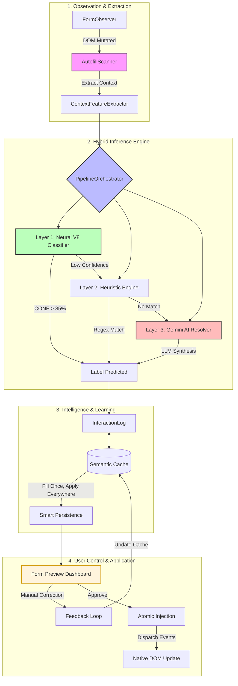

# Drafting the Future of Job Hunting: Introducing Nova Apply 🚀

*The story behind building a privacy-first, AI-powered extension that makes job applications feel like magic.*

---

Applying for jobs is a full-time job. We’ve all been there: copy-pasting the same resume details into endless forms on Greenhouse, Lever, and Workday. It's repetitive, prone to errors, and frankly, exhausting.

Today, I’m excited to share **Nova Apply** — a Chrome extension designed to transform this experience using modern AI and a "human-in-the-loop" philosophy. It's not just an autofiller; it's your personal job-apply co-pilot that follows a simple rule: **Fill it once, apply everywhere.**

## Why Another Autofiller?

Standard browser autofill is great for your address, but it fails miserably at the nuance of a job application. It doesn't understand your "Total Years of Experience," it can't distinguish between your "Start Date" for Job A vs. Job B, and it certainly won't help you navigate those tricky "Skills" multi-selects.

Nova Apply was built to solve these high-stakes edge cases with 95%+ accuracy.

## The Architecture: A Multi-Layered Intelligence System 🏗️

To achieve 95%+ accuracy while maintaining zero-lag performance, we built a complex orchestration pipeline. Here is how Nova Apply processes a form from the moment you land on a page:

### Deep Dive: the Neural V8 Engine
We didn't want to just "call an API" for every field. We built a **Multi-Label Sigmoid Neural Network** that runs entirely locally in your browser. 
*   **Architecture**: Input(95) → Dense(256) → Dense(128) → Sigmoid(87 outputs).
*   **Feature Engineering**: The model analyzes 86 keyword-based features and 9 structural features (like field type and position) to understand the "Intent" of a field.
*   **Performance**: Since it uses a weight-calculated math kernel locally, predictions happen in under **10ms**, ensuring the UI never feels sluggish.

### The 4-Tier Orchestration Pipeline

To manage this complexity, we developed the **PipelineOrchestrator**. It’s the conductor of our performance, managing a strict 4-phase lifecycle:

1.  **Context Extraction**: Deep-scanning the DOM to extract not just labels, but surrounding context and placeholders.
2.  **Structural Mapping**: Using our Neural V8 engine to identify repeating sections (like Education rows) vs. atomic fields.
3.  **The "Single Writer" Prep**: Resolving any data conflicts before a single value is committed to the page.
4.  **Atomic Injection**: Filling the form with native event dispatching (`change`, `input`) to ensure web apps like React and Angular recognize the data.

### Layered Storage: The 3-Tier Cache
Caching complex forms is hard. We implemented a custom **InteractionLog** with three distinct storage strategies:
1.  **ATOMIC_SINGLE**: For unique facts (e.g., your Phone Number).
2.  **ATOMIC_MULTI**: For sets of values (e.g., your Programming Languages).
3.  **SECTION_REPEATER**: The most complex layer, handling row-based data for Work Experience and Education history.

## The Human-in-the-Loop Experience

We know AI isn't perfect, so we built features to give you total control:

### 1. Visual Validation: The Form Preview
Before you commit to a form, Nova Apply gives you a **Preview Tab**. It's an enterprise-grade dashboard where you can see exactly what the AI has extracted from your resume. Any missing fields are highlighted, and you can correct them before they ever touch the job portal.

### 2. Iterative Excellence: AI Regeneration
Not happy with a generated answer or a cover letter snippet? Every field in the Nova Sidebar comes with a **"Regenerate with AI"** button. If the first answer wasn't quite right, just click it, and the AI will offer a fresh perspective based on your latest resume context. It’s like having a professional editor sitting right next to you.

## Why Nova Apply is Your Secret Weapon

*   **Accuracy Over Speed**: While we are fast (<10ms local inference), our priority is being right. Our hybrid model significantly reduces the "hallucination" risk common in pure AI tools.
*   **Smart Semantic Persistence**: This is the real game-changer. Nova Apply doesn't just fill your form; it **learns your preferences**. When you manually select an option or correct a field, Nova saves that choice indexed by its semantic meaning. The next time you encounter a similar question on *any* other site, it’s filled automatically. You fill it once; Nova remembers it forever.
*   **Privacy or Nothing**: Your data never leaves your machine unless you're talking to the AI model. No third-party data collection, no ads, just utility.

Building Nova Apply wasn't just about code; it was about stability. We’ve implemented robust **Redeclaration Shields** and **Null-Safety Guards** to ensure the extension never crashes, even on the most poorly coded enterprise job portals.

## The Verdict: Why Nova Apply Wins

If you're tired of the soul-crushing repetition of job applications, Nova Apply is the upgrade you've been waiting for. It’s not just about filling text boxes; it’s about **confidence**. Confidence that your data is accurate, confidence that your privacy is protected, and confidence that you’re putting your best foot forward in every single application.

Save hours per week, avoid "form fatigue," and get back to what matters: finding your next great role.

---

## Join the Journey

Nova Apply is more than just a tool; it's an experiment in making AI truly useful for the everyday professional. 

**[Check out the project on GitHub / Follow the Store Submission]**

---

*I'd love to hear your thoughts! Have you ever felt the "form fatigue"? How are you using AI in your daily workflows? Let's chat in the comments!*

#AI #Productivity #JobHunt #ChromeExtension #WebDev #GeminiAI
