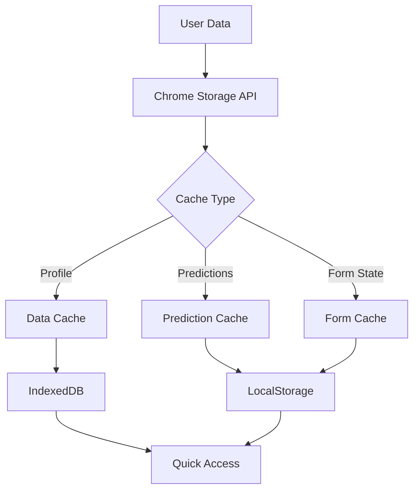
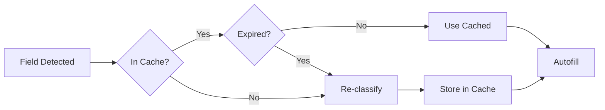
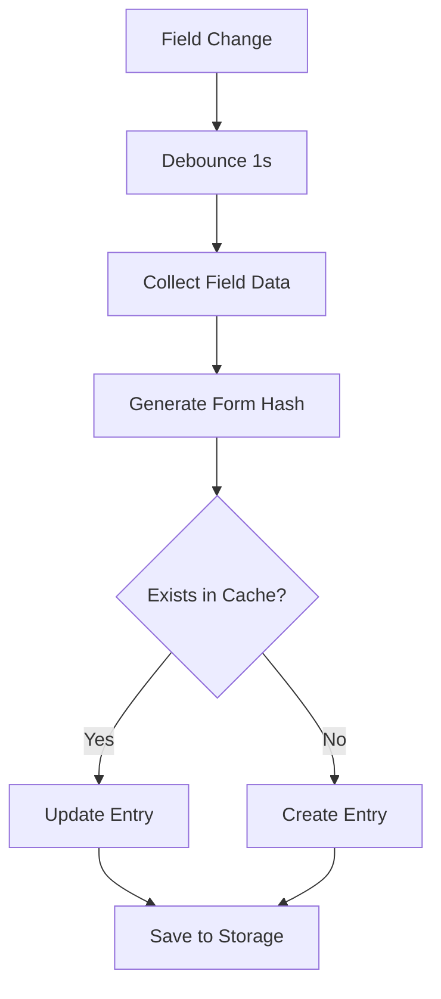

# Autofill Cache System Documentation

## Overview

The cache system stores user data and field predictions to enable instant form filling and improve performance across job applications. It consists of three main components:

1. **Data Cache** - User profile information
2. **Prediction Cache** - Previously classified field types
3. **Form Cache** - Saved form states and progress

---

## Architecture



---

## Data Cache

### Purpose
Stores user profile information for autofilling forms.

### Structure

```javascript
{
  "profile": {
    // Personal Info
    "first_name": "John",
    "last_name": "Doe",
    "email": "john.doe@example.com",
    "phone": "+1-555-123-4567",
    
    // Location
    "address_line_1": "123 Main St",
    "city": "San Francisco",
    "state": "CA",
    "zip_code": "94105",
    "country": "United States",
    
    // Work Experience
    "current_company": "TechCorp Inc",
    "current_title": "Senior Software Engineer",
    "years_experience": "8",
    
    // Education
    "institution_name": "Stanford University",
    "degree_type": "Bachelor of Science",
    "field_of_study": "Computer Science",
    "graduation_date": "2016-05",
    
    // Social Media
    "linkedin_url": "https://linkedin.com/in/johndoe",
    "github_url": "https://github.com/johndoe",
    "portfolio_url": "https://johndoe.dev",
    
    // ... 135+ field types
  },
  "timestamp": "2026-01-16T00:00:00Z",
  "version": "1.0"
}
```

### Storage
- **Location**: Chrome Storage (Sync)
- **Size Limit**: 100 KB per profile
- **Sync**: Across Chrome browsers
- **Encryption**: User data at rest

---

## Prediction Cache

### Purpose
Cache field type predictions to avoid re-classification and improve performance.

### Structure

```javascript
{
  "predictions": {
    "form_hash_123abc": {
      "fields": {
        "user_email": {
          "label": "email",
          "confidence": 0.95,
          "timestamp": 1705363200000
        },
        "first_name_input": {
          "label": "first_name",
          "confidence": 0.90,
          "timestamp": 1705363200000
        }
      },
      "url": "https://example.com/apply",
      "expires": 1705449600000  // 24 hours
    }
  }
}
```

### Cache Strategy



### Cache Invalidation

- **Time-based**: 24 hours TTL
- **Form-based**: When form structure changes
- **Manual**: User can clear cache

---

## Form Cache

### Purpose
Save partially completed forms and application progress.

### Structure

```javascript
{
  "saved_forms": {
    "job_123_company_xyz": {
      "url": "https://xyz.com/careers/job/123",
      "company": "XYZ Corp",
      "position": "Software Engineer",
      "filled_fields": {
        "email": "john.doe@example.com",
        "phone": "+1-555-123-4567",
        "years_experience": "8"
      },
      "completion": 65,  // percentage
      "last_saved": 1705363200000,
      "status": "in_progress"
    }
  }
}
```

### Auto-Save



---

## Cache Performance

### Hit Rates

| Cache Type | Hit Rate | Benefit |
|------------|----------|---------|
| **Prediction Cache** | ~85% | Avoid re-classification (3ms saved) |
| **Data Cache** | ~95% | Instant field fill (< 1ms) |
| **Form Cache** | ~40% | Resume applications |

### Storage Usage

| Component | Average Size | Max Size |
|-----------|--------------|----------|
| **Data Cache** | ~50 KB | 100 KB |
| **Prediction Cache** | ~20 KB | 500 KB |
| **Form Cache** | ~100 KB | 5 MB |
| **Total** | ~170 KB | 5.6 MB |

---

## API Reference

### Data Cache

```javascript
// Get cached profile data
const profile = await cache.getProfile();

// Update profile field
await cache.updateField('email', 'new.email@example.com');

// Clear all profile data
await cache.clearProfile();
```

### Prediction Cache

```javascript
// Get cached prediction
const prediction = await cache.getPrediction(formHash, fieldId);

// Store prediction
await cache.storePrediction(formHash, fieldId, {
    label: 'email',
    confidence: 0.95
});

// Clear old predictions
await cache.clearExpiredPredictions();
```

### Form Cache

```javascript
// Save form progress
await cache.saveFormProgress(formId, {
    filled_fields: {...},
    completion: 65
});

// Load saved form
const savedForm = await cache.getFormProgress(formId);

// List all saved forms
const forms = await cache.listSavedForms();
```

---

## Security & Privacy

### Encryption
- Profile data encrypted at rest
- AES-256-GCM encryption
- Key derived from user's Chrome profile

### Privacy Controls
- User can view all cached data
- One-click cache clearing
- Incognito mode: no caching

### Data Retention
- Profile data: Indefinite (until cleared)
- Predictions: 24 hours
- Form progress: 30 days

---

## Files

| File | Purpose |
|------|---------|
| `cache-manager.js` | Cache orchestration and API |
| `storage-adapter.js` | Chrome Storage abstraction |
| `encryption-helper.js` | Data encryption/decryption |
| `cache-cleaner.js` | Periodic cleanup and maintenance |

---

## Future Improvements

1. **Smart Expiration**: ML-based cache eviction
2. **Compression**: Reduce storage footprint
3. **Sync Conflict Resolution**: Better multi-device handling
4. **Prediction Confidence Decay**: Lower confidence over time
