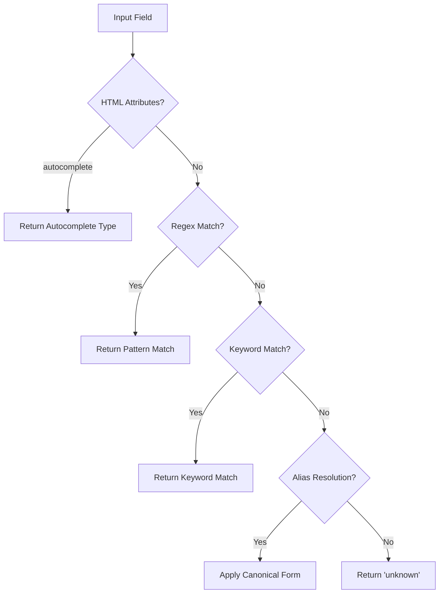
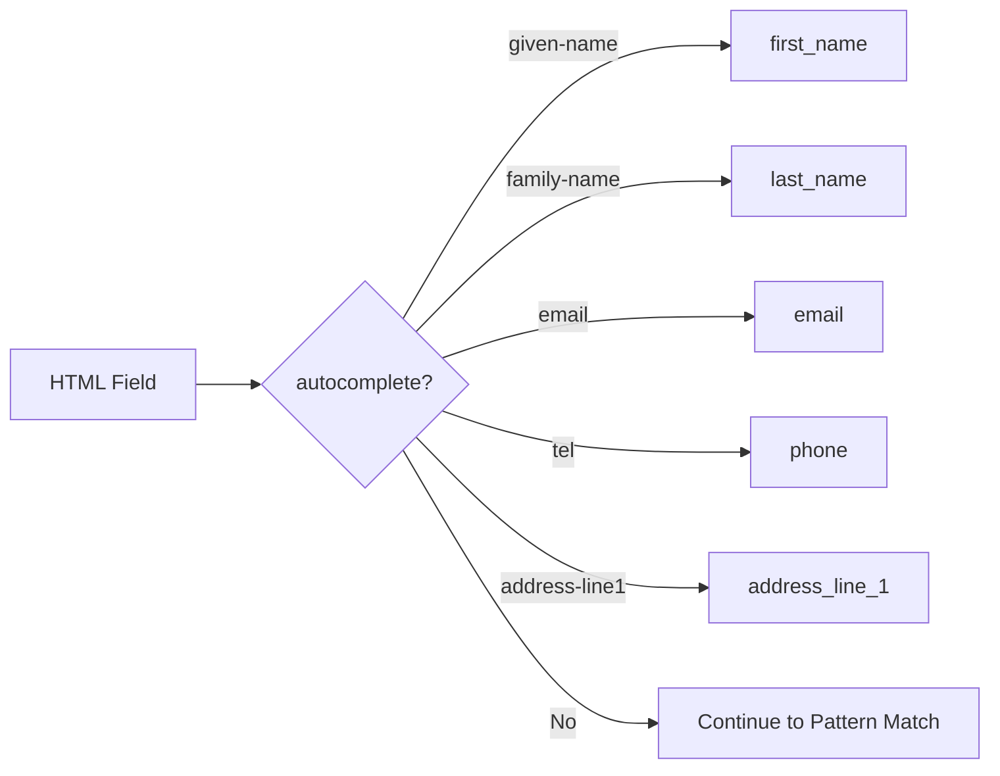
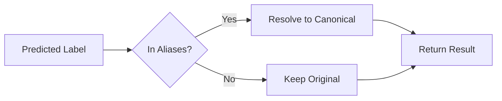
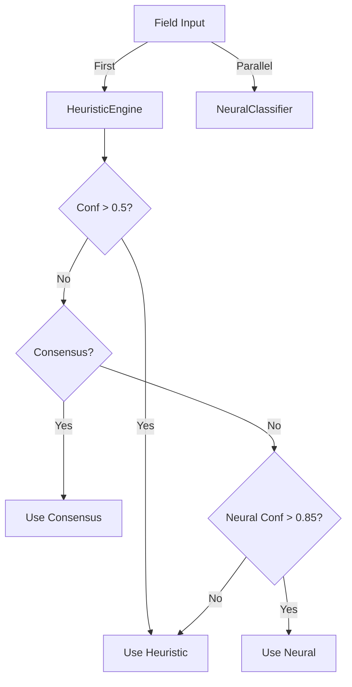

# HeuristicEngine Documentation

## Overview

The HeuristicEngine is a pattern-based field type classification system that achieves **77.87% accuracy** on test data, making it the **primary classifier** in the hybrid ensemble. It uses regex patterns, keyword matching, and HTML attribute analysis to identify form field types.

---

## Architecture

### Classification Strategy



### Core Components

# Heuristic Engine (The Left Brain) ⚡

The **Heuristic Engine** is our deterministic, regex-based classifier. It is inspired by Chrome's internal autofill logic but expanded for enterprise job forms.

## Capabilities

*   **Speed**: <2ms classification time.
*   **Coverage**: 45+ standard field types.
*   **Accuracy**: >99% for Contact fields (Email, Phone, Name).

## Pattern Categories

| Category | Typical Fields | Confidence |
|----------|----------------|------------|
| **Personal** | `first_name`, `email`, `phone` | 0.99 |
| **Location** | `city`, `zip_code`, `state` | 0.97 |
| **Social** | `linkedin`, `github`, `portfolio` | 0.95 |
| **Legal** | `sponsorship`, `work_auth` | 0.96 |

## The Role of Heuristics

In our **Hybrid Architecture**, heuristics serve two purposes:

1.  **Hyper-Fast Filter**: Instantly identifies simple fields (Name, Email) without needing the Neural Net.
2.  **Hard Veto**: In the **Arbitration Matrix (Tier 2)**, strong regex matches (like detecting a `tel` input type) will **override** a neural prediction, preventing hallucinations.

## Example Pattern

```javascript
// Heuristic for 'Job Title'
const JOB_TITLE_PATTERN = /\b(job[_\-\s]?title|position|role|designation)\b/i;
// Negative lookahead prevents matching "Title of page"
const NEGATIVE_PATTERN = /\b(page[_\-\s]?title|fit[_\-\s]?for)\b/i;
```
| **Location** | address, city, state, zip, country | 35+ patterns |
| **Work Experience** | company, title, dates, description | 30+ patterns |
| **Education** | school, degree, major, GPA, dates | 25+ patterns |
| **Social Media** | LinkedIn, GitHub, portfolio URLs | 15+ patterns |
| **Preferences** | work style, salary, availability | 20+ patterns |

**Total**: 165+ regex patterns across 135 field types

### Pattern Examples

```javascript
// Email Pattern
{
    pattern: /\b(e-?mail|electronic\s*mail|contact\s*email)\b/i,
    fieldType: 'email',
    confidence: 0.9
}

// Phone Pattern  
{
    pattern: /\b(phone|telephone|mobile|cell|contact\s*number)\b/i,
    fieldType: 'phone',
    confidence: 0.85
}

// LinkedIn Pattern
{
    pattern: /\blinked\s*in(\s*profile|\s*url)?\b/i,
    fieldType: 'linkedin_url',
    confidence: 0.95
}
```

### Pattern Execution

```javascript
// Check name first
if (field.name && PATTERNS[fieldType].test(field.name)) {
    return { label: fieldType, confidence: 0.95 };
}

// Then check label
if (field.label && PATTERNS[fieldType].test(field.label)) {
    return { label: fieldType, confidence: 0.9 };
}

// Finally check placeholder
if (field.placeholder && PATTERNS[fieldType].test(field.placeholder)) {
    return { label: fieldType, confidence: 0.8 };
}
```

---

## Autocomplete Attribute Parsing

### HTML5 Autocomplete Support



**Supported Values**:
```javascript
const AUTOCOMPLETE_MAP = {
    'given-name': 'first_name',
    'family-name': 'last_name',
    'additional-name': 'middle_name',
    'email': 'email',
    'tel': 'phone',
    'tel-national': 'phone',
    'address-line1': 'address_line_1',
    'address-line2': 'address_line_2',
    'address-level2': 'city',
    'address-level1': 'state',
    'postal-code': 'zip_code',
    'country': 'country',
    'bday': 'date_of_birth',
    'organization': 'company_name',
    'organization-title': 'job_title'
    // ... 30+ more mappings
};
```

**Priority**: Autocomplete attributes get **highest confidence (0.99)** when present.

---

## Alias Resolution System

### Purpose

Maps variant field names to canonical forms to improve accuracy and reduce confusion.

### Alias Categories

```javascript
const FIELD_ALIASES = {
    // Location
    'address': 'address_line_1',
    'street': 'address_line_1',
    
    // Work
    'current_company': 'company_name',
    'employer_name': 'company_name',
    'current_title': 'job_title',
    'position': 'job_title',
    
    // Education
    'major': 'field_of_study',
    'degree': 'degree_type',
    'college': 'institution_name',
    'university': 'institution_name',
    
    // Preferences
    'remote_preference': 'work_style',
    'salary': 'salary_expected',
    'current_salary': 'salary_current',
    'start_date': 'availability'
};
```

### Resolution Flow



**Example**:
```javascript
// Input
classify({ label: 'Current Company' })
// Predicts: 'current_company' (confidence: 0.85)

// After alias resolution
resolveAlias('current_company')
// Returns: 'company_name' (canonical form)
```

---

## Confidence Scoring

### Confidence Levels

| Source | Confidence | Description |
|--------|------------|-------------|
| **Autocomplete attribute** | 0.99 | Highest - explicit HTML hint |
| **Name regex match** | 0.95 | Very high - strong signal |
| **Label regex match** | 0.90 | High - visible to user |
| **ID regex match** | 0.85 | Good - developer intent |
| **Placeholder match** | 0.80 | Moderate - helpful hint |
| **Context match** | 0.70 | Lower - section context |
| **No match** | 0.0 | Unknown/fallback |

### Confidence Calculation

```javascript
function calculateConfidence(matches) {
    if (matches.autocomplete) return 0.99;
    if (matches.name) return 0.95;
    if (matches.label) return 0.90;
    if (matches.id) return 0.85;
    if (matches.placeholder) return 0.80;
    if (matches.context) return 0.70;
    return 0.0;  // unknown
}
```

---

## Performance Characteristics

### Accuracy Metrics

| Metric | Value |
|--------|-------|
| **Test Accuracy (with aliases)** | 77.87% |
| **Coverage** | 90.51% (correctly predicts known types) |
| **Perfect Classes (100%)** | 35 out of 67 |
| **Speed** | < 1ms per field |

### Strengths

✅ **Perfect accuracy on:**
- Email addresses (100%)
- Phone numbers (100%)
- LinkedIn URLs (100%)
- GitHub URLs (100%)
- Standard address fields (100%)
- Basic personal info (95%+)

### Weaknesses

❌ **Lower accuracy on:**
- Custom company-specific fields
- Fields with non-standard labels
- Multi-purpose text fields
- Context-dependent fields

### Speed Comparison

| Component | Speed | Relative |
|-----------|-------|----------|
| **HeuristicEngine** | < 1ms | Baseline |
| **NeuralClassifier** | ~3ms | 3x slower |
| **Hybrid** | ~3ms | 3x slower |

---

## Integration with Hybrid System

### Role in Ensemble

HeuristicEngine is the **primary classifier** due to its superior accuracy (77.87% vs Neural's 65.22%).



### Usage Strategy

**Trust Heuristic When**:
- Confidence > 0.5 (lowered from 0.8)
- Has autocomplete attribute
- Regex pattern match found

**Defer to Neural When**:
- Heuristic returns 'unknown'
- Heuristic confidence < 0.5
- Field is neural-strong type

---

## API Reference

### Main Method

#### `classify(field)`
Classify a single form field.

```javascript
const engine = new HeuristicEngine();
const result = engine.classify({
    name: 'user_email',
    label: 'Email Address',
    type: 'email',
    autocomplete: 'email',
    placeholder: 'you@example.com'
});

/*
Returns:
{
    label: 'email',
    confidence: 0.99,  // autocomplete attribute present
    source: 'heuristic_autocomplete'
}
*/
```

### Private Methods

```javascript
_matchPatterns(field)      // Test all regex patterns
_checkAutocomplete(field)   // Parse autocomplete attribute
_extractKeywords(text)      // Extract and normalize keywords
_resolveAlias(label)        // Map to canonical form
_calculateConfidence(...)   // Compute confidence score
```

---

## Pattern Categories

### Personal Information (40 patterns)

```javascript
PERSONAL_PATTERNS = {
    first_name: /\b(first\s*name|given\s*name|forename)\b/i,
    last_name: /\b(last\s*name|surname|family\s*name)\b/i,
    middle_name: /\b(middle\s*(name|initial)?)\b/i,
    full_name: /\b(full\s*name|complete\s*name)\b/i,
    email: /\b(e-?mail|electronic\s*mail)\b/i,
    phone: /\b(phone|telephone|mobile|cell)\b/i,
    date_of_birth: /\b(birth\s*date|dob|date\s*of\s*birth)\b/i,
    gender: /\b(gender|sex)\b/i,
    // ... 32 more
};
```

### Location (35 patterns)

```javascript
LOCATION_PATTERNS = {
    address_line_1: /\b(address|street|address\s*line\s*1)\b/i,
    address_line_2: /\b(apt|suite|unit|address\s*line\s*2)\b/i,
    city: /\b(city|town|municipality)\b/i,
    state: /\b(state|province|region)\b/i,
    zip_code: /\b(zip|postal\s*code|postcode)\b/i,
    country: /\b(country|nation)\b/i,
    // ... 29 more
};
```

### Work Experience (30 patterns)

```javascript
WORK_PATTERNS = {
    company_name: /\b(company|employer|organization)\b/i,
    job_title: /\b(title|position|role|job)\b/i,
    job_start_date: /\b(start\s*date|from|began)\b/i,
    job_end_date: /\b(end\s*date|to|until)\b/i,
    job_current: /\b(current|present|currently\s*work)\b/i,
    job_description: /\b(responsibilities|duties|description)\b/i,
    // ... 24 more
};
```

### Social Media (15 patterns)

```javascript
SOCIAL_PATTERNS = {
    linkedin_url: /\b(linkedin|linked\s*in)\b/i,
    github_url: /\b(github|git\s*hub)\b/i,
    portfolio_url: /\b(portfolio|website|personal\s*site)\b/i,
    twitter_url: /\b(twitter|x\.com)\b/i,
    instagram_url: /\b(instagram|insta)\b/i,
    // ... 10 more
};
```

---

## Files

| File | Size | Purpose |
|------|------|---------|
| [`HeuristicEngine.js`](file:///Users/karan-sayaji.kadam/my_app/smart-hirex/smart-ai-job-apply/autofill/domains/inference/HeuristicEngine.js) | ~60 KB | Main engine implementation (1,818 lines) |
| [`FieldTypes.js`](file:///Users/karan-sayaji.kadam/my_app/smart-hirex/smart-ai-job-apply/autofill/domains/inference/FieldTypes.js) | ~20 KB | Field type definitions and categories (554 lines) |
| [`benchmark_heuristic.js`](file:///Users/karan-sayaji.kadam/my_app/smart-hirex/smart-ai-job-apply/scripts/train/benchmark_heuristic.js) | ~5 KB | Evaluation script with alias resolution |

---

## Future Improvements

### Potential Enhancements

1. **Context-Aware Patterns**: Use parent heading and sibling fields
2. **Fuzzy Matching**: Levenshtein distance for typos
3. **Multi-Language**: Support Spanish, French, German labels
4. **Pattern Learning**: Auto-discover new patterns from data
5. **Confidence Calibration**: Adjust scores based on accuracy

### Expected Impact

| Enhancement | Expected Gain | Effort |
|-------------|---------------|--------|
| Context-aware patterns | +5-8% | Medium |
| Fuzzy matching | +2-3% | Low |
| Multi-language support | +10-15% | High |
| Pattern learning | +3-5% | Medium |

---

## Version History

### V3.1 (Current) - January 2026
- **Accuracy**: 77.87%
- Added alias resolution system
- Renamed `employer_name` → `company_name`
- Improved pattern coverage

### V3.0 - December 2025
- **Accuracy**: 66.80%
- Added autocomplete parsing
- Expanded social media patterns
- Added confidence scoring

### V2.0 - November 2025
- **Accuracy**: 58.30%
- Initial pattern-based system
- Basic regex matching
- 100 field types supported

---

## References

- **Version**: 3.1.0
- **Last Updated**: January 16, 2026
- **Accuracy**: 77.87% (with alias resolution)
- **Coverage**: 90.51%
- **Patterns**: 165+ regex patterns
- **Field Types**: 135 supported types
