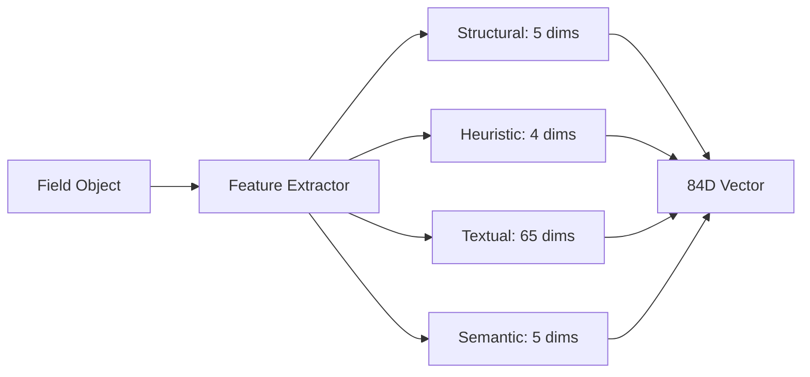
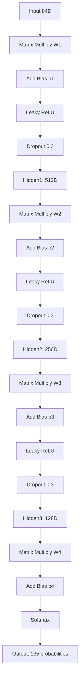
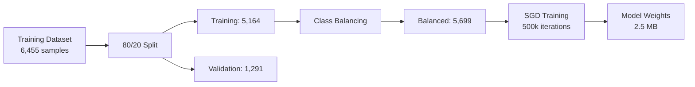
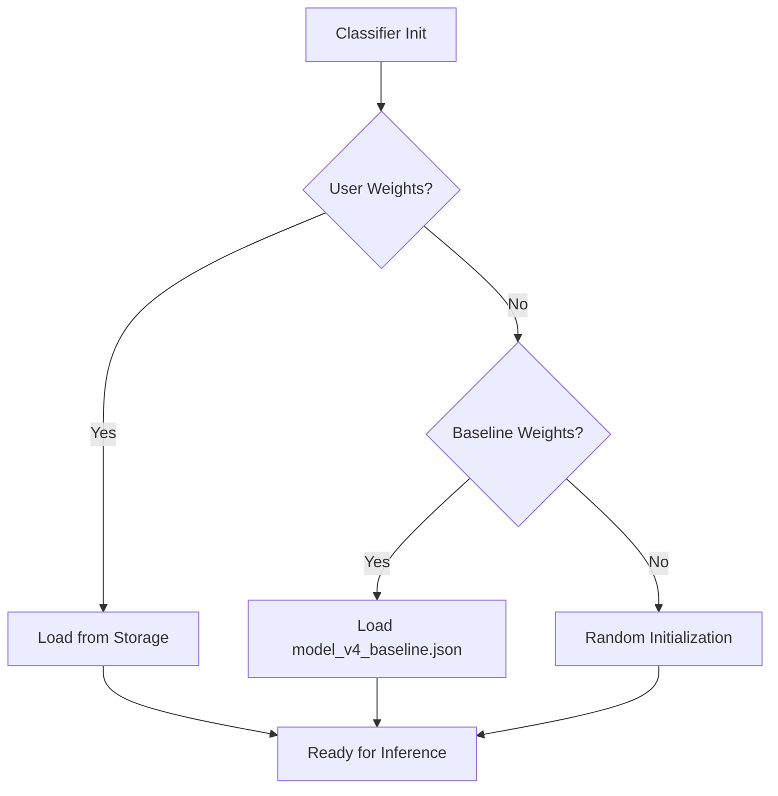
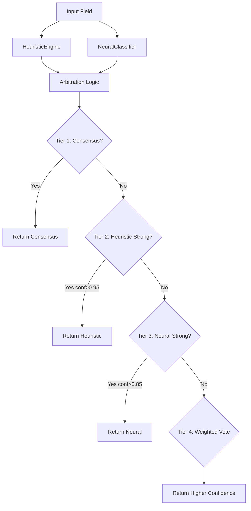

# Neural Classifier Documentation

## Overview

The Neural Classifier is a deep learning-based field type classification system that uses a 3-layer neural network to identify form field types based on extracted features. It achieves **65.22% accuracy** on test data and serves as a backup classifier in the hybrid ensemble.

---

## Architecture

### Network Structure

**Neural V5 Architecture:**
```
Input Layer:       84 features
  ↓ (W1: 84×512, He initialization)
Hidden Layer 1:    512 neurons (Leaky ReLU + Dropout 0.3)
  ↓ (W2: 512×256, He initialization)
Hidden Layer 2:    256 neurons (Leaky ReLU + Dropout 0.3)
  ↓ (W3: 256×128, He initialization)
Hidden Layer 3:    128 neurons (Leaky ReLU + Dropout 0.3)
  ↓ (W4: 128×135, Xavier initialization)
Output Layer:      135 field types (Softmax)
```

**Total Parameters:** ~233,000  
**Model Size:** 2.5 MB  
**Inference Speed:** ~3ms per field

---

## How It Works

### 1. Feature Extraction

The [FeatureExtractor](file:///Users/karan-sayaji.kadam/my_app/smart-hirex/smart-ai-job-apply/autofill/domains/inference/feature-extractor.js) converts raw field data into an 84-dimensional feature vector:



**Feature Breakdown (84 dimensions):**

| Category | Dimensions | Description |
|----------|------------|-------------|
| **Structural** | 5 | Input type one-hot encoding (text, number, email, password, tel) |
| **Heuristic** | 4 | Has label, has placeholder, visual weight, is complex select |
| **Textual** | 65 | Hashed bag-of-words from label (20), name/ID (20), placeholder (5), context (5), parent (10), siblings (10) |
| **Semantic** | 5 | Levenshtein distance similarity to: email, phone, name, address, date |

**Example Feature Vector:**
```javascript
[
  0, 1, 0, 0, 0,           // Structural: text input
  1, 0, 0.7, 0,            // Heuristic: has label, visual weight 0.7
  0.2, 0.5, ...            // Textual: 65 hashed values
  0.8, 0.1, 0.9, 0.2, 0.3  // Semantic: similarities
]
```

### 2. Forward Propagation



**Mathematical Operations:**

```javascript
// Layer 1: Input → Hidden1
z1[j] = b1[j] + Σ(inputs[i] * W1[i][j])
h1[j] = LeakyReLU(z1[j]) = max(0.01 * z1[j], z1[j])
h1_dropout[j] = h1[j] * (random() > 0.3 ? 1 : 0)

// Layer 2: Hidden1 → Hidden2
z2[j] = b2[j] + Σ(h1[i] * W2[i][j])
h2[j] = LeakyReLU(z2[j])
h2_dropout[j] = h2[j] * (random() > 0.3 ? 1 : 0)

// Layer 3: Hidden2 → Hidden3
z3[j] = b3[j] + Σ(h2[i] * W3[i][j])
h3[j] = LeakyReLU(z3[j])
h3_dropout[j] = h3[j] * (random() > 0.3 ? 1 : 0)

// Output: Hidden3 → Probabilities
logits[k] = b4[k] + Σ(h3[j] * W4[j][k])
probs[k] = exp(logits[k]) / Σ(exp(logits[i]))  // Softmax
```

### 3. Prediction

```javascript
// Get highest probability
const maxProb = Math.max(...probs);
const classIndex = probs.indexOf(maxProb);

// Map to field type
const label = FieldTypes.getFieldTypeFromIndex(classIndex);

// Apply confidence threshold
if (maxProb < 0.15) {
    label = 'generic_question';  // Low confidence fallback
}

return {
    label: label,
    confidence: maxProb,
    source: 'neural_network'
};
```

---

## Training Process

### Data Pipeline



### Training Algorithm

**Stochastic Gradient Descent (SGD) with:**
- Learning rate: 0.05 (with decay)
- L2 regularization: λ = 0.01
- Dropout: 0.3 during training
- Batch size: 1 (online learning)

**Backpropagation:**
```javascript
// 1. Compute output error
δ_output = (predicted - target) * softmax_derivative

// 2. Backpropagate to Hidden3
δ_h3 = (W4^T * δ_output) * leaky_relu_derivative(z3)

// 3. Backpropagate to Hidden2
δ_h2 = (W3^T * δ_h3) * leaky_relu_derivative(z2)

// 4. Backpropagate to Hidden1
δ_h1 = (W2^T * δ_h2) * leaky_relu_derivative(z1)

// 5. Update weights with L2 regularization
W4 -= learningRate * (h3^T * δ_output + λ * W4)
W3 -= learningRate * (h2^T * δ_h3 + λ * W3)
W2 -= learningRate * (h1^T * δ_h2 + λ * W2)
W1 -= learningRate * (input^T * δ_h1 + λ * W1)
```

---

## Model Persistence

### Weight Storage

Weights are stored in JSON format at:
```
autofill/domains/inference/model_v4_baseline.json
```

**Structure:**
```json
{
  "version": "5.0.0",
  "timestamp": "2026-01-16T01:10:00Z",
  "architecture": {
    "input_size": 84,
    "hidden_layers": [512, 256, 128],
    "output_size": 135
  },
  "weights": {
    "W1": [[...], ...],  // 84 × 512
    "b1": [...],         // 512
    "W2": [[...], ...],  // 512 × 256
    "b2": [...],         // 256
    "W3": [[...], ...],  // 256 × 128
    "b3": [...],         // 128
    "W4": [[...], ...],  // 128 × 135
    "b4": [...]          // 135
  }
}
```

### Loading Process



---

## Performance Characteristics

### Accuracy Metrics

| Metric | Value |
|--------|-------|
| **Test Accuracy (with aliases)** | 65.22% |
| **Test Accuracy (exact match)** | 56.52% |
| **Perfect Classes (100%)** | 18 out of 67 |
| **Failed Classes (0%)** | 9 out of 67 |

### Strengths

✅ **Perfect accuracy on:**
- Personal info: `first_name`, `email`, `phone`
- Location: `city`, `state`, `zip_code`, `country`
- Social media: `linkedin_url`, `github_url`
- Profile: `skills`, `languages`, `certifications`

### Weaknesses

❌ **Poor performance on:**
- Rare fields: `emergency_contact_name`, `dietary_restrictions`
- Text fields: `cover_letter`, `why_company`
- Similar fields: `email_secondary` vs `email`
- Ambiguous fields: `job_current`, `availability`

### Speed

- **Inference**: ~3ms per field
- **Forward pass**: ~2ms
- **Feature extraction**: ~1ms

---

## Integration with Hybrid System

### Role in Ensemble

The Neural Classifier works alongside [HeuristicEngine](./heuristic-engine.md) in a 5-tier hybrid arbitration system:



### Usage Strategy

**Primary Scenarios for Neural:**
1. HeuristicEngine returns 'unknown'
2. HeuristicEngine has low confidence (< 0.5)
3. Field is neural-strong (social media, skills)

**Default:** Trust HeuristicEngine (77.87% accuracy) over Neural (65.22%)

---

## API Reference

### Main Methods

#### `init()`
Initialize the classifier and load weights.
```javascript
const classifier = new NeuralClassifier({ debug: false });
await classifier.init();
```

#### `predict(field)`
Predict field type for a single field.
```javascript
const result = classifier.predict({
    label: 'Email Address',
    name: 'email',
    placeholder: 'you@example.com',
    id: 'user-email',
    type: 'email'
});
// Returns: { label: 'email', confidence: 0.95, source: 'neural_network' }
```

#### `train(features, label)`
Train the model on a single sample (online learning).
```javascript
await classifier.train(featureVector, 'first_name');
```

#### `exportWeights()`
Export current model weights.
```javascript
const weights = classifier.exportWeights();
```

#### `importWeights(weights)`
Import and set model weights.
```javascript
await classifier.importWeights(savedWeights);
```

---

## Configuration

### Constants

Located in [neural-classifier.js](file:///Users/karan-sayaji.kadam/my_app/smart-hirex/smart-ai-job-apply/autofill/domains/inference/neural-classifier.js):

```javascript
static INPUT_SIZE = 84;              // Feature vector dimensions
static HIDDEN1_SIZE = 512;           // First hidden layer
static HIDDEN2_SIZE = 256;           // Second hidden layer
static HIDDEN3_SIZE = 128;           // Third hidden layer
static DROPOUT_RATE = 0.3;           // Dropout probability
static LEARNING_RATE = 0.05;         // SGD learning rate
static L2_LAMBDA = 0.01;             // Regularization strength
static LEAKY_RELU_ALPHA = 0.01;      // Leaky ReLU slope
static CONFIDENCE_THRESHOLD = 0.15;   // Minimum confidence
```

---

## Files

| File | Purpose |
|------|---------|
| [`neural-classifier.js`](file:///Users/karan-sayaji.kadam/my_app/smart-hirex/smart-ai-job-apply/autofill/domains/inference/neural-classifier.js) | Main classifier implementation (1,128 lines) |
| [`feature-extractor.js`](file:///Users/karan-sayaji.kadam/my_app/smart-hirex/smart-ai-job-apply/autofill/domains/inference/feature-extractor.js) | Feature extraction logic (446 lines) |
| [`model_v4_baseline.json`](file:///Users/karan-sayaji.kadam/my_app/smart-hirex/smart-ai-job-apply/autofill/domains/inference/model_v4_baseline.json) | Trained model weights (2.5 MB) |
| [`train_model.js`](file:///Users/karan-sayaji.kadam/my_app/smart-hirex/smart-ai-job-apply/scripts/train/train_model.js) | Training script (356 lines) |
| [`benchmark_neural.js`](file:///Users/karan-sayaji.kadam/my_app/smart-hirex/smart-ai-job-apply/scripts/train/benchmark_neural.js) | Evaluation script with alias resolution |

---

## Future Improvements

### Potential Enhancements

1. **Data Augmentation**: Real-world form scraping (not synthetic)
2. **Architecture**: Attention mechanisms, transformer layers
3. **Features**: Add visual features (font size, color, position)
4. **Ensemble**: Weighted voting based on field type
5. **Confidence Calibration**: Platt scaling for better probability estimates

### Expected Impact

| Enhancement | Expected Gain | Effort |
|-------------|---------------|--------|
| Real training data (10k samples) | +10-15% | High |
| Confidence calibration | +2-3% | Low |
| Visual features | +3-5% | Medium |
| Attention layers | +5-8% | High |

---

## References

- **Version**: 5.0.0
- **Last Updated**: January 16, 2026
- **Accuracy**: 65.22% (with alias resolution)
- **Training Data**: 6,455 samples
- **Test Data**: 253 samples
