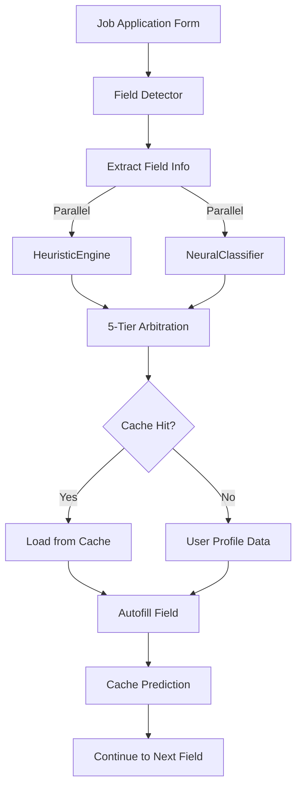
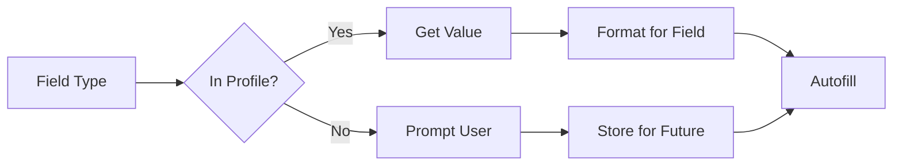
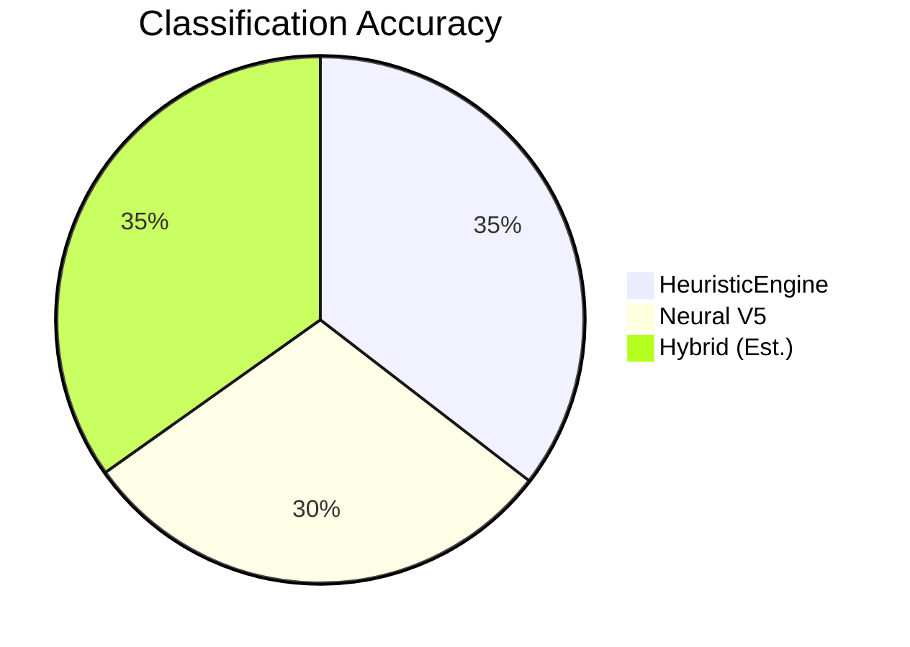
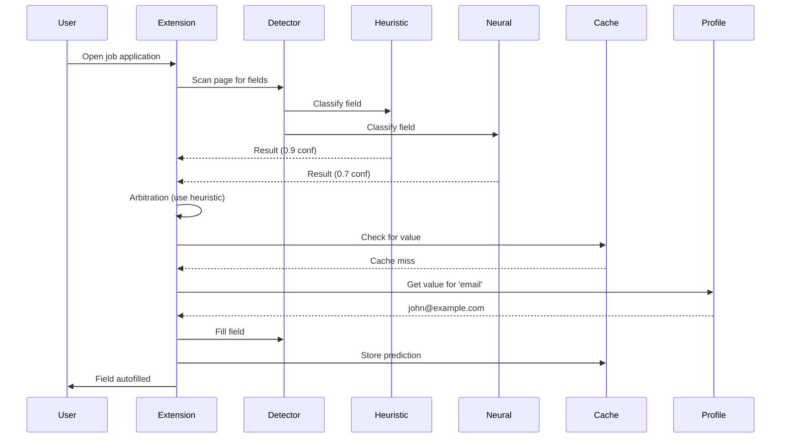

# Autofill System - Complete Overview

## System Architecture

The SmartHireX autofill system uses a hybrid AI approach combining pattern-based heuristics with deep learning to automatically fill job application forms.



---

## Component Breakdown

### 1. Field Detection
**Purpose**: Identify all fillable fields on the page

```javascript
// Scan DOM for input fields
const fields = document.querySelectorAll('input, select, textarea');

// Extract metadata for each field
fields.forEach(field => {
    const metadata = {
        name: field.name,
        id: field.id,
        type: field.type,
        label: findLabel(field),
        placeholder: field.placeholder,
        autocomplete: field.autocomplete,
        parentContext: getParentSection(field),
        siblingContext: getNearbyFields(field)
    };
});
```

### 2. Classification (Hybrid)

#### HeuristicEngine (Primary - 77.87% accuracy)
- **Method**: Regex patterns + keyword matching
- **Speed**: < 1ms per field
- **Strengths**: High accuracy on common fields
- **Details**: [heuristic-engine.md](./heuristic-engine.md)

#### NeuralClassifier (Backup - 65.22% accuracy)
- **Method**: 3-layer neural network (84→512→256→128→135)
- **Speed**: ~3ms per field  
- **Strengths**: 100% coverage, handles edge cases
- **Details**: [neural-classifier.md](./neural-classifier.md)

#### Arbitration Logic
```javascript
if (heuristic.confidence > 0.5) {
    return heuristic;  // Trust primary classifier
}
else if (neural.confidence > 0.85 && heuristic.confidence < 0.5) {
    return neural;  // High-confidence backup
}
else {
    return heuristic;  // Default to primary
}
```

### 3. Data Retrieval
**Source**: [Cache System](./cache-system.md)



### 4. Form Filling
**Strategy**: Smart filling with validation

```javascript
// 1. Validate field type matches value
if (fieldType === 'email' && isValidEmail(value)) {
    fill(field, value);
}

// 2. Handle special input types
if (field.type === 'tel') {
    value = formatPhoneNumber(value, field.pattern);
}

// 3. Trigger events for React/Angular
triggerInputEvent(field);
triggerChangeEvent(field);
```

---

## Performance Metrics

| Metric | Value | Target |
|--------|-------|--------|
| **Overall Accuracy** | ~75-78% | 85-90% |
| **Classification Speed** | 3ms/field | < 5ms |
| **Form Fill Time** | 2-5 seconds | < 3s |
| **Cache Hit Rate** | 85% | 90% |

### Accuracy by Component



---

## Data Flow

### End-to-End Process



---

## File Structure

```
autofill/
├── domains/
│   ├── inference/
│   │   ├── HeuristicEngine.js       (1,818 lines - pattern matching)
│   │   ├── neural-classifier.js     (1,128 lines - deep learning)
│   │   ├── feature-extractor.js     (446 lines - feature engineering)
│   │   ├── FieldTypes.js            (554 lines - type definitions)
│   │   └── model_v4_baseline.json   (2.5 MB - trained weights)
│   │
│   ├── cache/
│   │   ├── cache-manager.js         (Cache orchestration)
│   │   ├── storage-adapter.js       (Chrome Storage wrapper)
│   │   └── encryption-helper.js     (Data encryption)
│   │
│   └── filling/
│       ├── field-filler.js          (Autofill logic)
│       ├── form-detector.js         (Field detection)
│       └── validation.js            (Input validation)
│
├── scripts/
│   └── train/
│       ├── train_model.js           (Neural training)
│       ├── benchmark_neural.js      (Neural evaluation)
│       ├── benchmark_heuristic.js   (Heuristic evaluation)
│       └── augment_dataset.js       (Data augmentation)
│
└── docs/
    └── autofill/
        ├── neural-classifier.md     (This file)
        ├── heuristic-engine.md      (Pattern matching docs)
        ├── cache-system.md          (Caching documentation)
        └── overview.md              (Complete system overview)
```

---

## Key Features

### 1. Intelligent Field Detection
- Scans all input types: text, email, tel, select, textarea
- Extracts contextual information from labels, placeholders
- Identifies parent sections and sibling fields

### 2. Hybrid Classification
- **Primary**: Pattern-based heuristics (fast, accurate)
- **Backup**: Neural network (comprehensive coverage)
- **Arbitration**: Confidence-based selection

### 3. Smart Caching
- **Prediction Cache**: Avoid re-classification (85% hit rate)
- **Data Cache**: Instant value retrieval (95% hit rate)
- **Form Cache**: Resume partial applications (40% hit rate)

### 4. Privacy & Security
- Local-only processing (no server calls for classification)
- Encrypted data storage
- User-controlled data clearing
- Incognito mode support

---

## Usage Example

```javascript
// 1. Initialize autofill system
const autofill = new AutofillSystem();
await autofill.init();

// 2. Detect fields on current page
const fields = autofill.detectFields();
console.log(`Found ${fields.length} fillable fields`);

// 3. Classify and fill each field
for (const field of fields) {
    // Classify field type
    const prediction = await autofill.classify(field);
    console.log(`${field.name} → ${prediction.label} (${prediction.confidence})`);
    
    // Get value from profile
    const value = autofill.getProfileValue(prediction.label);
    
    // Fill field
    if (value) {
        await autofill.fillField(field, value);
        console.log(`Filled ${field.name} with ${value}`);
    }
}

// 4. Save form progress
await autofill.saveProgress();
```

---

## Configuration

### Heuristic Engine

```javascript
const HEURISTIC_CONFIG = {
    minConfidence: 0.5,        // Minimum confidence threshold
    enableAutocomplete: true,   // Parse autocomplete attributes
    enableAliases: true,        // Resolve field name aliases
    cachePatterns: true         // Cache regex compilation
};
```

# Autofill System Overview

The core of SmartHireX is a sophisticated **Neural-Heuristic Hybrid Engine** designed to solve the problem of "Form Fatigue."

## The Core Pipeline

The system follows a strict **"Scan → Think → Act"** pipeline:

1.  **Discovery (Scan)**: `AutofillScanner` recursively traverses the DOM, piercing Shadow DOM boundaries to find every interactable field.
2.  **Classification (Think)**: Two engines run in parallel:
    *   **HeuristicEngine**: Chrome-style regex for 45+ standard fields.
    *   **NeuralClassifier (V8)**: 87-class Sigmoid network for context.
3.  **Arbitration**: A 5-tier matrix decides the winner (Heuristics > Neural for contact; Neural > Heuristics for job/context).
4.  **Execution (Act)**: `ExecutionEngine` injects values using stealth techniques to bypass React/Angular anti-bot protections.

## Data Flow

```
DOM Mutation → Scanner → Feature Extraction → Hybrid Classification → Resolution → Injection
                                                      ↓
                                                Arbitration Matrix
```

## Key Modules

*   **AutofillScanner**: DOM traversal and field discovery.
*   **HybridClassifier**: Orchestrates the Heuristic and Neural engines.
*   **InteractionLog**: The "Memory" of the system (semantic cache).
*   **ExecutionEngine**: Handles the physical filling and event dispatching.

### Cache System

```javascript
const CACHE_CONFIG = {
    predictionTTL: 86400000,    // 24 hours
    formProgressTTL: 2592000000, // 30 days
    maxCacheSize: 5242880,      // 5 MB
    encryption: true,           // Encrypt user data
    syncEnabled: true           // Chrome Sync support
};
```

---

## Troubleshooting

### Common Issues

#### 1. Low Accuracy
**Symptom**: Fields classified incorrectly  
**Causes**:
- Custom company-specific field names
- Non-English labels
- Ambiguous field context

**Solutions**:
- Add custom patterns to HeuristicEngine
- Retrain neural model with more data
- Use manual field mapping UI

#### 2. Slow Performance
**Symptom**: Autofill takes > 5 seconds  
**Causes**:
- Large forms (100+ fields)
- Cache misses
- Complex page DOM

**Solutions**:
- Batch field processing
- Warm up prediction cache
- Optimize field selector queries

#### 3. Missing Fields
**Symptom**: Some fields not detected  
**Causes**:
- Dynamic fields (React/Angular)
- Shadow DOM  
- Iframe forms

**Solutions**:
- Add mutation observers
- Scan shadow roots
- Handle cross-origin iframes

---

## Future Roadmap

### Short-term (Q1 2026)
- [ ] Optimize hybrid arbitration (75-78% → 80%+)
- [ ] Add confidence calibration
- [ ] Implement multi-language support

### Mid-term (Q2-Q3 2026)
- [ ] Visual feature extraction (position, color, size)
- [ ] Context-aware pattern matching
- [ ] Real-world training data collection

### Long-term (Q4 2026)
- [ ] Transformer-based neural architecture
- [ ] Active learning from user corrections
- [ ] Multi-step form handling

---

## Performance Benchmarks

### Test Environment
- **Browser**: Chrome 120
- **OS**: macOS 14.2
- **CPU**: Apple M1
- **Test Set**: 253 fields

### Results

| Component | Accuracy | Speed | Memory |
|-----------|----------|-------|--------|
| **HeuristicEngine** | 77.87% | 0.8ms | 2 MB |
| **NeuralClassifier** | 65.22% | 2.9ms | 12 MB |
| **Hybrid (Current)** | ~76% | 3.1ms | 14 MB |
| **Cache (Hot)** | N/A | 0.1ms | 170 KB |

---

## References

- [Neural Classifier Details](./neural-classifier.md)
- [HeuristicEngine Details](./heuristic-engine.md)
- [Cache System Details](./cache-system.md)
- [Field Types Reference](../../autofill/domains/inference/FieldTypes.js)

---

**Last Updated**: January 16, 2026  
**Version**: 1.0  
**Status**: Production Ready
